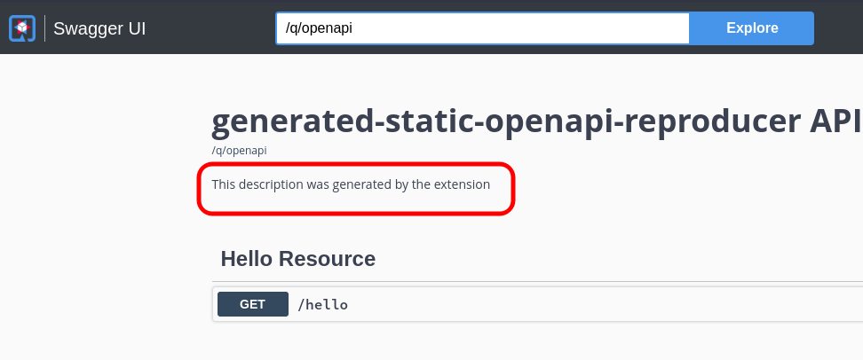

# This project is a reproducer for [this issue](https://github.com/quarkusio/quarkus/issues/27541).

## How to reproduce the issue

1. Install the extension

    ```shell
    cd static-openapi-document-generator-extension
    mvn install
    ```

2. Run the project that uses the extension

    ```shell
    cd generated-static-openapi-reproducer
    mvn clean quarkus:dev
    ```

    > **_IMPORTANT:_**  Keep the `clean` goal in the above command

3. Open the [Swagger UI](http://localhost:8080/q/swagger-ui/). You will not see the description you can see in the image below. That's the issue.

    